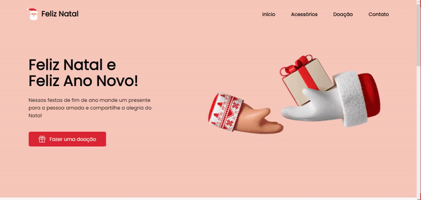

<h2 align="center">
  Desafios Codelândia
</h2>

  Objetivo dos desafios é ajudá-lo a melhorar suas habilidades fazendo mini projetos semanais.

  <a href="https://discord.com/invite/QevDJqCzaY">Entre na nossa comunidade!</a>

>
---
### **Desafio 16 - Feliz Natal e Feliz Ano novo** 

Link do desafio no Figma: [Clique aqui](https://www.figma.com/file/Yb9IBH56g7T1hdIyZ3BMNO/Desafios---Codel%C3%A2ndia?node-id=39340%3A782)

>
---
<h2 align="center">
  Tecnologias
</h2>

>
---
## 📝 Licença

Esse projeto está sob a licença MIT. Veja o arquivo [LICENSE](LICENSE) para mais detalhes.

---

Feito com 💜 by **Codelândia** [Entre na nossa comunidade!](https://discord.com/invite/QevDJqCzaY)
